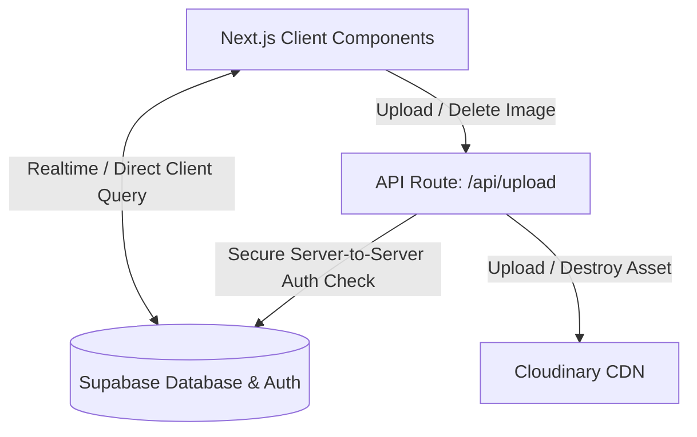
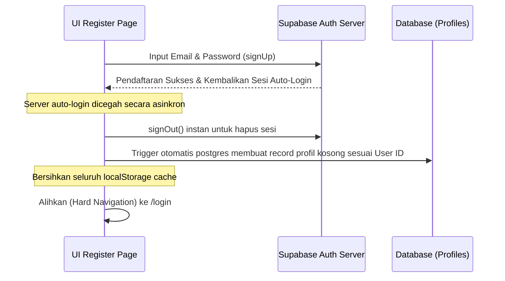
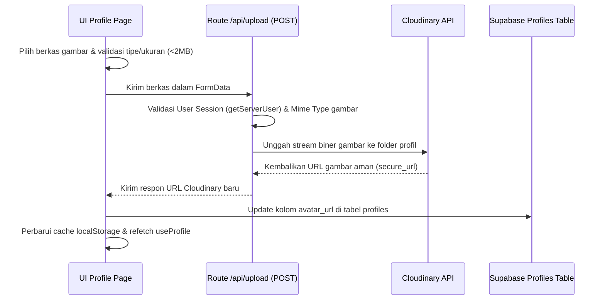
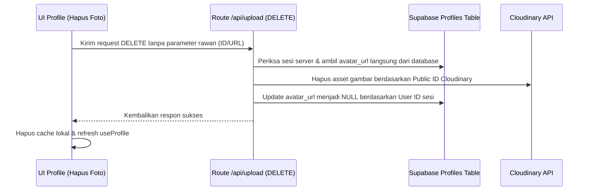
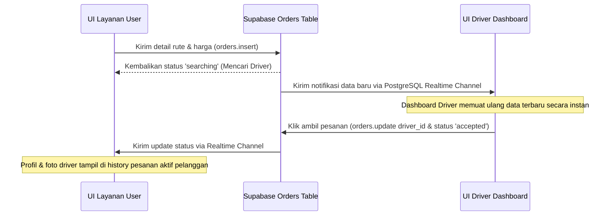

# Panduan Developer & Transfer Knowledge Proyek KOMAH

Dokumen ini dirancang sebagai panduan lengkap serah-terima (*developer handover*) agar anggota tim baru atau pengembang baru dapat langsung memahami struktur proyek, menemukan file penting dengan cepat, memahami alur kerja fitur, dan melanjutkan pengembangan proyek KOMAH secara mandiri.

---

## Daftar Isi
0. [Pusat Dokumentasi](#pusat-dokumentasi)
1. [Arsitektur Umum](#1-arsitektur-umum)
2. [Peta Folder & Struktur Direktori](#2-peta-folder--struktur-direktori)
3. [Daftar File Penting (Core Files)](#3-daftar-file-penting-core-files)
4. [Entry Point & Komponen Per Fitur](#4-entry-point--komponen-per-fitur)
5. [Cara Kerja Hook `useProfile` & Cache](#5-cara-kerja-hook-useprofile--cache)
6. [Alur Aksi UI ke Database (Sequence Diagrams)](#6-alur-aksi-ui-ke-database-sequence-diagrams)
7. [Hal-Hal yang Wajib Diwaspadai](#7-hal-hal-yang-wajib-diwaspadai)
8. [Log Pembersihan Kode (Dead Code Cleanup Log)](#8-log-pembersihan-kode-dead-code-cleanup-log)

---

## Pusat Dokumentasi

Jika ingin membuka dokumentasi teknis yang lebih terstruktur, gunakan [pusat dokumentasi KOMAH](docs/README.md).

---

## 1. Arsitektur Umum

KOMAH menggunakan arsitektur **Next.js (App Router)** dengan pola **Client-Side Query & State Management** terpusat menggunakan layanan backend-as-a-service **Supabase** dan penyimpanan gambar **Cloudinary**:



### Komponen Utama:
1.  **Frontend (Next.js)**: Berjalan secara *client-side* murni (`'use client'`) untuk interaksi responsif (0ms delay) menggunakan SWR (Stale-While-Revalidate) caching buatan sendiri.
2.  **Supabase Auth & Database**: Menangani sesi otentikasi pengguna, penyimpanan data relasional (tabel `profiles`, `orders`), serta sinkronisasi data instan via *PostgreSQL Realtime Channel*.
3.  **Route Handlers (Next.js API)**: Endpoint `/api/upload` digunakan khusus sebagai *secure bridge* untuk mengunggah dan menghapus aset gambar di Cloudinary secara aman agar kunci API rahasia Cloudinary tidak bocor ke sisi client.

---

## 2. Peta Folder & Struktur Direktori

Berikut adalah struktur folder utama proyek KOMAH yang perlu Anda ketahui sebelum menulis/mengubah kode:

```text
├── app/                             # Folder Utama Aplikasi (Next.js App Router)
│   ├── (auth)/                      # Grouping Rute Autentikasi (Tidak muncul di URL)
│   │   ├── login/                   # Halaman Login
│   │   └── register/                # Halaman Pendaftaran Akun (Pilih Peran)
│   │       ├── driver/              # Form Pendaftaran Akun Driver
│   │       └── pengguna/            # Form Pendaftaran Akun Pelanggan (Customer)
│   ├── (dashboard)/                 # Grouping Rute Dashboard (Diproteksi Middleware)
│   │   ├── driver/                  # Halaman & Fitur khusus Driver
│   │   │   ├── history/             # Riwayat tarikan driver
│   │   │   ├── pendapatan/          # Ringkasan saldo & pendapatan driver
│   │   │   ├── pesanan/             # Layanan navigasi peta & orderan aktif
│   │   │   ├── profile/             # Pengaturan data diri & upload foto driver
│   │   │   ├── layout.js            # Sidebar, Navigasi, & Pop-up logout driver
│   │   │   └── page.jsx             # Dashboard utama driver (Order berjalan & statistik)
│   │   └── user/                    # Halaman & Fitur khusus Pelanggan
│   │       ├── delivery/            # Fitur pemesanan pengiriman barang
│   │       ├── food/                # Fitur pemesanan makanan (KOMAH Food)
│   │       ├── helper/              # Fitur pemesanan jasa helper/asisten
│   │       ├── history/             # Riwayat pesanan aktif & selesai (Cetak Struk)
│   │       ├── profile/             # Pengaturan data diri & upload foto pelanggan
│   │       ├── ride/                # Fitur pemesanan ojek (Antar/Jemput)
│   │       ├── layout.js            # Sidebar, Navigasi, & Pop-up logout pelanggan
│   │       └── page.jsx             # Halaman pilihan menu utama pelanggan
│   ├── (public)/                    # Grouping Halaman Publik
│   │   └── page.js                  # Halaman Landing Page Utama (komah.com)
│   ├── api/                         # Endpoint API Internal
│   │   └── upload/                  # Route handler upload/delete foto profil di Cloudinary
│   ├── globals.css                  # CSS Global Proyek (Menggunakan Tailwind CSS v4)
│   └── layout.js                    # Root Layout pembungkus aplikasi
├── components/                      # Komponen UI Reusable
│   ├── OrderMap.jsx                 # Komponen Peta Leaflet untuk melacak lokasi order
│   └── MapPicker.jsx                # Komponen Pemilih koordinat lokasi jemput/tujuan
├── lib/                             # Folder Utilitas & Konfigurasi
│   ├── hooks/                       # Custom React Hooks
│   │   └── useProfile.js            # Hook pengelola cache profil, session, & auth
│   ├── supabase/                    # Inisialisasi Klien Supabase
│   │   ├── client.js                # Browser Client (untuk komponen 'use client')
│   │   └── server.js                # Server Client (untuk API route & Server Components)
│   ├── constants.js                 # Data statis (tarif, koordinat UIN, status order)
│   ├── osrm.js                      # Helper kalkulasi rute jalan raya (jarak & rute polyline)
│   └── pdf.js                       # Helper pembuat receipt struk pesanan PDF (jspdf)
├── middleware.js                    # Proteksi rute & pengalihan login otomatis (auth guard)
├── package.json                     # Konfigurasi dependensi npm
└── README.md                        # Dokumentasi program (Dokumen ini)
```

---

## 3. Daftar File Penting (Core Files)

Jika Anda ingin memodifikasi atau memperbaiki bagian penting dari sistem, buka file-file berikut:

1.  **[lib/hooks/useProfile.js](file:///home/rafa/Kuliah/WebPrograming/mogakelar/Project-KOMAH/lib/hooks/useProfile.js)**
    *   *Peran*: Mengelola caching profil, sesi autentikasi, dan memicu pembaruan data secara asinkron pasca-render. Modifikasi file ini jika Anda ingin mengubah cara data profil diambil, disimpan ke cache, atau dibersihkan saat logout.
2.  **[app/api/upload/route.js](file:///home/rafa/Kuliah/WebPrograming/mogakelar/Project-KOMAH/app/api/upload/route.js)**
    *   *Peran*: Gerbang API internal untuk otentikasi user, pembersihan foto lama, pengunggahan foto baru ke Cloudinary, dan penghapusan foto secara aman di database. Buka file ini jika terjadi kegagalan proses di server saat pengunggahan gambar.
3.  **[middleware.js](file:///home/rafa/Kuliah/WebPrograming/mogakelar/Project-KOMAH/middleware.js)**
    *   *Peran*: Mengatur *route guard*. Menentukan apakah pengguna yang belum login boleh membuka halaman tertentu, dan mengarahkan pengguna ke halaman yang tepat sesuai peran (`driver` ke `/driver`, `customer` ke `/user`).
4.  **[lib/constants.js](file:///home/rafa/Kuliah/WebPrograming/mogakelar/Project-KOMAH/lib/constants.js)**
    *   *Peran*: Pusat konfigurasi aplikasi. Berisi harga dasar tarif, tarif per km, koordinat default peta kampus UIN Suska Riau, format rupiah, formatting tanggal, dan helper pembuatan URL chat WhatsApp (`buildWhatsAppUrl`).
5.  **[components/OrderMap.jsx](file:///home/rafa/Kuliah/WebPrograming/mogakelar/Project-KOMAH/components/OrderMap.jsx)**
    *   *Peran*: Komponen peta Leaflet utama yang merender penjemputan, tujuan, rute jalan raya, dan fit-bounds otomatis. Modifikasi ini jika Anda ingin mengubah tampilan marker atau interaksi peta.

---

## 4. Entry Point & Komponen Per Fitur

Gunakan tabel pemetaan di bawah ini untuk mencari file program berdasarkan fitur yang ingin Anda ubah atau pelajari:

| Nama Fitur | File Halaman Utama | Komponen Pendukung | Tabel Database | Deskripsi Alur Fitur |
| :--- | :--- | :--- | :--- | :--- |
| **Pemesanan Ojek (Antar/Jemput)** | [ride/page.jsx](file:///home/rafa/Kuliah/WebPrograming/mogakelar/Project-KOMAH/app/(dashboard)/user/ride/page.jsx) | `OrderMap.jsx`, `MapPicker.jsx` | `orders` | Menginput nama lokasi & titik koordinat peta $\rightarrow$ hitung jarak & harga $\rightarrow$ simpan ke database dengan status `searching`. |
| **Pemesanan Pengiriman (KOMAH Delivery)** | [delivery/page.jsx](file:///home/rafa/Kuliah/WebPrograming/mogakelar/Project-KOMAH/app/(dashboard)/user/delivery/page.jsx) | `OrderMap.jsx`, `MapPicker.jsx` | `orders` | Menginput detail barang, nomor WA penerima, titik jemput/tujuan $\rightarrow$ kalkulasi tarif $\rightarrow$ simpan pesanan. |
| **Pemesanan Makanan (KOMAH Food)** | [food/page.jsx](file:///home/rafa/Kuliah/WebPrograming/mogakelar/Project-KOMAH/app/(dashboard)/user/food/page.jsx) | `OrderMap.jsx`, `MapPicker.jsx` | `orders` | Menginput detail makanan/resto $\rightarrow$ pilih lokasi pengantaran $\rightarrow$ simpan pesanan. |
| **Pemesanan Jasa (KOMAH Helper)** | [helper/page.jsx](file:///home/rafa/Kuliah/WebPrograming/mogakelar/Project-KOMAH/app/(dashboard)/user/helper/page.jsx) | `constants.js` (tarif minimum) | `orders` | Menginput deskripsi tugas jasa/bantuan $\rightarrow$ tarif awal dihitung minimum Rp5.000 (selanjutnya bisa dinego via WA) $\rightarrow$ simpan pesanan. |
| **Riwayat & Cetak Struk (Pelanggan)** | [history/page.jsx](file:///home/rafa/Kuliah/WebPrograming/mogakelar/Project-KOMAH/app/(dashboard)/user/history/page.jsx) | `lib/pdf.js` (`generateOrderReceipt`) | `orders`, `profiles` | Mengambil data order berdasarkan ID Pelanggan $\rightarrow$ kelompokkan pesanan aktif dan selesai $\rightarrow$ unduh struk pesanan PDF menggunakan jsPDF. |
| **Pengaturan Profil & Foto (Pelanggan & Driver)** | [profile/page.jsx (User)](file:///home/rafa/Kuliah/WebPrograming/mogakelar/Project-KOMAH/app/(dashboard)/user/profile/page.jsx) & [profile/page.jsx (Driver)](file:///home/rafa/Kuliah/WebPrograming/mogakelar/Project-KOMAH/app/(dashboard)/driver/profile/page.jsx) | `lib/hooks/useProfile.js`, `/api/upload` | `profiles` | Mengubah nama/nomor WA $\rightarrow$ memicu input file upload profil $\rightarrow$ tembak API Route $\rightarrow$ Simpan di profiles. |
| **Dashboard Peta & Ambil Order (Driver)** | [page.jsx (Driver)](file:///home/rafa/Kuliah/WebPrograming/mogakelar/Project-KOMAH/app/(dashboard)/driver/page.jsx) & [pesanan/page.jsx](file:///home/rafa/Kuliah/WebPrograming/mogakelar/Project-KOMAH/app/(dashboard)/driver/pesanan/page.jsx) | `OrderMap.jsx` | `orders`, `profiles` | Berlangganan realtime data order berstatus `searching` $\rightarrow$ RPC `take_order` atau `release_order` $\rightarrow$ perbarui status pesanan menjadi `accepted`, `on_the_way`, atau `completed`. |

---

## 5. Cara Kerja Hook `useProfile` & Cache

Manajemen cache profil diatur menggunakan pola SWR (Stale-While-Revalidate):

1.  **Inisialisasi Bebas Hydration Mismatch**:
    Untuk menghindari kesalahan perbedaan render HTML server vs client, state `profile` diinisialisasi `null` dan `loading` diinisialisasi `true`.
2.  **Pemuatan Asinkron (`useEffect`)**:
    Setelah komponen berhasil dimuat di client (mount), `useEffect` membaca cache dari `localStorage` (`komah_profile_cache`) di dalam `setTimeout(..., 0)` dan memperbarui state secara asinkron.
3.  **Sinkronisasi Latar Belakang (SWR)**:
    Jika cache tersedia, antarmuka langsung dirender menggunakan data cache. Secara bersamaan, request background dikirim ke Supabase untuk mencocokkan data terbaru di database. Jika ada perbedaan, UI diperbarui secara halus tanpa interupsi.
4.  **Pembersihan Otomatis**:
    Saat pengguna keluar (logout) atau saat masuk ke halaman pendaftaran (registrasi), semua cache di `localStorage` (termasuk `'driverProfilePic'` dan `'userProfilePic'`) dihapus secara total untuk mencegah kebocoran data antar-sesi pengguna.

---

## 6. Alur Aksi UI ke Database (Sequence Diagrams)

### A. Alur Registrasi Akun Baru (Tanpa Auto-Login Terobos)



---

### B. Alur Mengunggah / Mengganti Foto Profil



---

### C. Alur Menghapus Foto Profil (DELETE)



---

### D. Alur Pemesanan Hingga Deteksi Realtime oleh Driver



---

## 7. Hal-Hal yang Wajib Diwaspadai

> [!CAUTION]
> **ATURAN EMAS PENGEMBANGAN PROYEK KOMAH**
>
> 1. **Jangan Hapus Sembarangan Kunci `localStorage`**:
>    Key `komah_profile_cache`, `komah_user_cache`, `driverProfilePic`, dan `userProfilePic` digunakan secara aktif untuk mengoptimalkan pemuatan UI dan navigasi offline. Jika ingin memodifikasi data ini, gunakan helper yang telah disediakan atau bersihkan secara bersih melalui fungsi logout/registrasi.
> 
> 2. **Upload & Delete Foto Wajib Lewat API Route**:
>    **Jangan pernah** mencoba melakukan integrasi upload foto Cloudinary langsung dari sisi client (komponen browser). Kunci API (`CLOUDINARY_API_KEY`) dan rahasia API (`CLOUDINARY_API_SECRET`) harus tetap aman berada di server (`/api/upload`) demi menghindari pencurian kuota penyimpanan gambar.
> 
> 3. **Sinkronisasi Otomatis Foto Profil**:
>    Jika Anda memodifikasi pengunggahan foto profil di halaman profil pelanggan atau driver, pastikan Anda memicu pembaruan Navbar dengan men-dispatch event kustom:
>    *   Pelanggan: `window.dispatchEvent(new Event('profilePictureUpdated'))`
>    *   Mitra Driver: `window.dispatchEvent(new Event('driverProfilePictureUpdated'))`
> 
> 4. **Middleware dan Sesi Server**:
>    Ingat bahwa file [server.js](file:///home/rafa/Kuliah/WebPrograming/mogakelar/Project-KOMAH/lib/supabase/server.js) menggunakan environment key `NEXT_PUBLIC_SUPABASE_PUBLISHABLE_KEY` with fallback ke `NEXT_PUBLIC_SUPABASE_ANON_KEY`. Pastikan berkas `.env.local` lokal Anda memiliki salah satu dari kunci tersebut agar server API Route tidak melempar kesalahan status `500 (Gagal memproses di server)`.
> 
> 5. **Otorisasi Sisi Server**:
>    Saat mengubah data database di Route Handler API, selalu ambil ID pengguna dari token autentikasi sesi yang valid (`supabase.auth.getUser()`), **bukan** menerima ID pengguna yang dikirimkan secara langsung dari parameter request client. Hal ini mencegah celah keamanan manipulasi ID pengguna lain.

---

## 8. Log Pembersihan Kode (Dead Code Cleanup Log)

Berikut adalah daftar modul dan berkas kode mati (*dead code*) yang telah dihapus dari proyek ini untuk penyederhanaan arsitektur aplikasi (penanganan lokal primitif `try-catch`):

*   **`lib/errors/AppError.js`** [DIHAPUS]
    *   *Alasan*: Class pembungkus error kustom global yang tidak lagi digunakan karena proyek sepenuhnya beralih ke penanganan lokal menggunakan `try-catch` primitif di masing-masing page/API.
*   **`lib/errors/errorHandler.js`** [DIHAPUS]
    *   *Alasan*: Translator error terpusat yang tidak lagi digunakan.
*   **`lib/hooks/queries/useOrders.js`** [DIHAPUS]
    *   *Alasan*: Hook query model arsitektur berlapis yang kompleks. Saat ini, client-side query mengambil data secara langsung menggunakan Supabase Client murni di tingkat komponen halaman untuk menjaga kesederhanaan dan meminimalkan bug.
