# 🏗️ Arsitektur Sistem KOMAH

> Dokumen ini menjelaskan arsitektur teknis aplikasi KOMAH secara menyeluruh, termasuk diagram sistem, alur data, keputusan desain, dan model keamanan.

---

## Daftar Isi

1. [Gambaran Umum Sistem](#1-gambaran-umum-sistem)
2. [Arsitektur Tingkat Tinggi (High-Level)](#2-arsitektur-tingkat-tinggi)
3. [Arsitektur Frontend (Next.js)](#3-arsitektur-frontend)
4. [Arsitektur Backend (Supabase + Cloudinary)](#4-arsitektur-backend)
5. [Model Data & Relasi](#5-model-data--relasi)
6. [Alur Autentikasi & Otorisasi](#6-alur-autentikasi--otorisasi)
7. [Alur Data Pesanan (Order Lifecycle)](#7-alur-data-pesanan)
8. [Integrasi Peta & Routing](#8-integrasi-peta--routing)
9. [Model Keamanan](#9-model-keamanan)
10. [Keputusan Desain (ADR)](#10-keputusan-desain)
11. [Batasan & Ketergantungan Eksternal](#11-batasan--ketergantungan-eksternal)
12. [Diagram Deployment](#12-diagram-deployment)

---

## 1. Gambaran Umum Sistem

KOMAH (**Ko**perasi **Ma**hasiswa) adalah aplikasi web *ride-hailing* kampus yang dirancang khusus untuk civitas akademika **UIN Suska Riau**. Aplikasi ini melayani 4 jenis layanan:

| Layanan | Kode | Deskripsi |
|---------|------|-----------|
| **Antar/Jemput** | `bike` | Ojek penumpang point-to-point |
| **Delivery** | `delivery` | Pengiriman barang antar lokasi kampus |
| **KOMAH Food** | `food` | Pemesanan makanan (ongkir dihitung sistem, harga makanan dibayar terpisah) |
| **Helper** | `helper` | Jasa bantuan umum (tarif minimum Rp 5.000, nego via WhatsApp) |

**Tech Stack:**
- **Frontend:** Next.js 16 (App Router), React 19, Tailwind CSS v4
- **Backend-as-a-Service:** Supabase (PostgreSQL, Auth, Realtime)
- **Penyimpanan Gambar:** Cloudinary CDN
- **Peta:** Leaflet + React-Leaflet, OpenStreetMap tiles
- **Routing:** OSRM (Open Source Routing Machine)
- **Geocoding:** Nominatim (OpenStreetMap)
- **PDF:** jsPDF + jspdf-autotable
- **Komunikasi:** WhatsApp Direct Link

---

## 2. Arsitektur Tingkat Tinggi

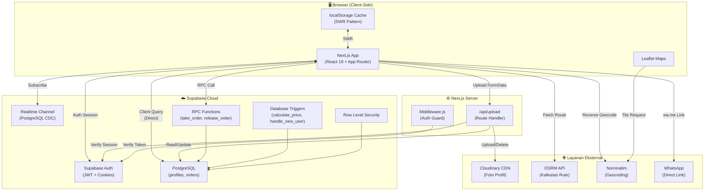

### Prinsip Arsitektur Utama

1. **Client-Side First**: Semua halaman menggunakan `'use client'` untuk interaksi responsif tanpa delay SSR
2. **Direct Database Query**: Komponen langsung query ke Supabase tanpa abstraction layer berlapis
3. **Server-Only Secrets**: API keys Cloudinary hanya diakses melalui Route Handler di server
4. **SWR Caching**: Data profil di-cache di `localStorage` untuk instant render (0ms delay)
5. **Realtime-Driven**: Dashboard driver menerima notifikasi pesanan baru secara instan via PostgreSQL Realtime

---

## 3. Arsitektur Frontend

### Pola Routing (App Router)

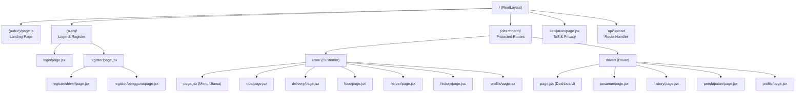

### Pola State Management

```
┌─────────────────────────────────────────────┐
│                useProfile Hook              │
│  ┌─────────┐    ┌──────────┐    ┌────────┐ │
│  │  Cache   │───>│  State   │───>│   UI   │ │
│  │(localStorage)│ │(React)   │    │(Render)│ │
│  └─────────┘    └──────────┘    └────────┘ │
│       ▲              ▲                      │
│       │              │                      │
│  ┌────┴────┐    ┌────┴─────┐               │
│  │ Write   │    │ Fetch    │               │
│  │ Cache   │<───│ Supabase │               │
│  └─────────┘    └──────────┘               │
└─────────────────────────────────────────────┘
```

Tidak menggunakan state manager global (Redux, Zustand, dll). Setiap halaman mengelola state-nya sendiri dengan:
- `useState` + `useEffect` untuk data lokal
- `useProfile()` hook untuk data profil/auth
- Supabase Realtime subscription untuk data pesanan

### Design System

Menggunakan **Tailwind CSS v4** dengan `@theme` directive sebagai pengganti `tailwind.config.js`:

| Token | Value | Penggunaan |
|-------|-------|-----------|
| `--color-tertiary` | `#F0C052` (Gold) | Aksen utama, CTA buttons |
| `--color-surface-container` | `#1F1F21` | Background kartu |
| `--color-text-primary` | `#F9FAFB` | Teks utama |
| `--color-text-secondary` | `#9CA3AF` | Teks pendukung |
| `--color-success` | `#10B981` | Status berhasil |
| `--color-cancel` | `#FF8F8F` | Status dibatalkan |

Typography:
- **Headlines:** Plus Jakarta Sans (600, 700)
- **Body:** DM Sans (400, 500, 700)
- **Monospace:** JetBrains Mono (500, 700)

---

## 4. Arsitektur Backend

### Supabase sebagai Backend

KOMAH menggunakan Supabase sebagai *Backend-as-a-Service* tanpa server backend kustom (kecuali 1 Route Handler untuk Cloudinary):

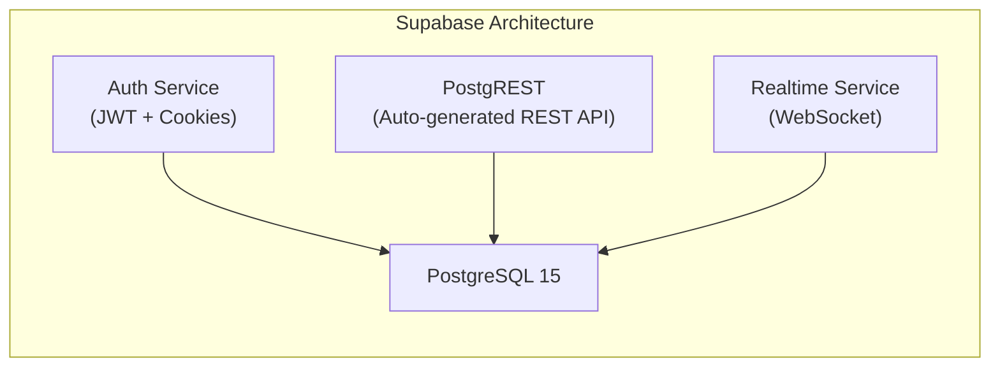

### Dual Supabase Client

| Client | File | Context | Pola |
|--------|------|---------|------|
| **Browser Client** | `lib/supabase/client.js` | `'use client'` components | Singleton per tab |
| **Server Client** | `lib/supabase/server.js` | Route Handlers, Middleware | Per-request (never cached) |

### Route Handler (`/api/upload`)

Satu-satunya endpoint API kustom, berfungsi sebagai *secure bridge* ke Cloudinary:

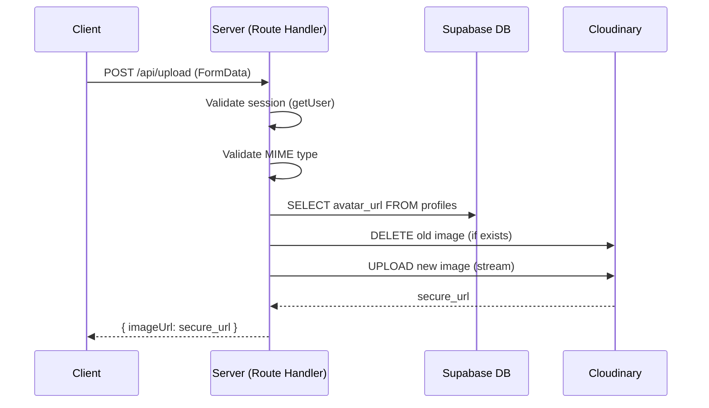

---

## 5. Model Data & Relasi

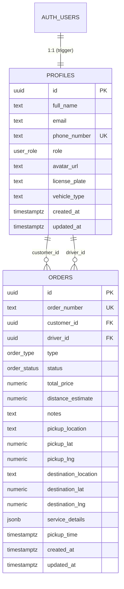

### ENUM Types

```sql
CREATE TYPE user_role AS ENUM ('customer', 'driver');
CREATE TYPE order_type AS ENUM ('bike', 'delivery', 'helper', 'food');
CREATE TYPE order_status AS ENUM ('searching', 'accepted', 'on_the_way', 'completed', 'cancelled');
```

### service_details (JSONB) per Order Type

| Type | Contoh service_details |
|------|----------------------|
| `bike` | `{}` (kosong) |
| `delivery` | `{ "item_description": "Buku paket", "receiver_phone": "628123..." }` |
| `food` | `{ "restaurant_name": "Ayam Geprek", "food_items": ["2x Geprek", "1x Es Teh"] }` |
| `helper` | `{ "task_description": "Bantu pindahkan barang ke gedung B" }` |

---

## 6. Alur Autentikasi & Otorisasi

### Middleware Auth Guard

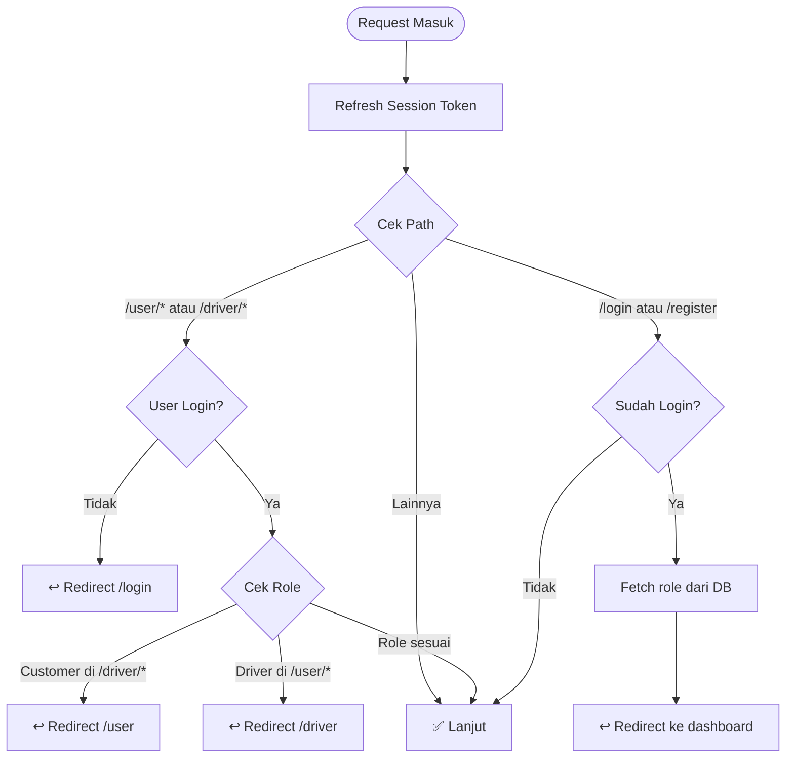

### Session Management
- **Transport:** HTTP-only cookies (managed by `@supabase/ssr`)
- **Refresh:** Otomatis di middleware pada setiap request
- **Client-side:** `getSession()` untuk cek cepat, `getUser()` untuk verifikasi server

---

## 7. Alur Data Pesanan

### Order Lifecycle (State Machine)

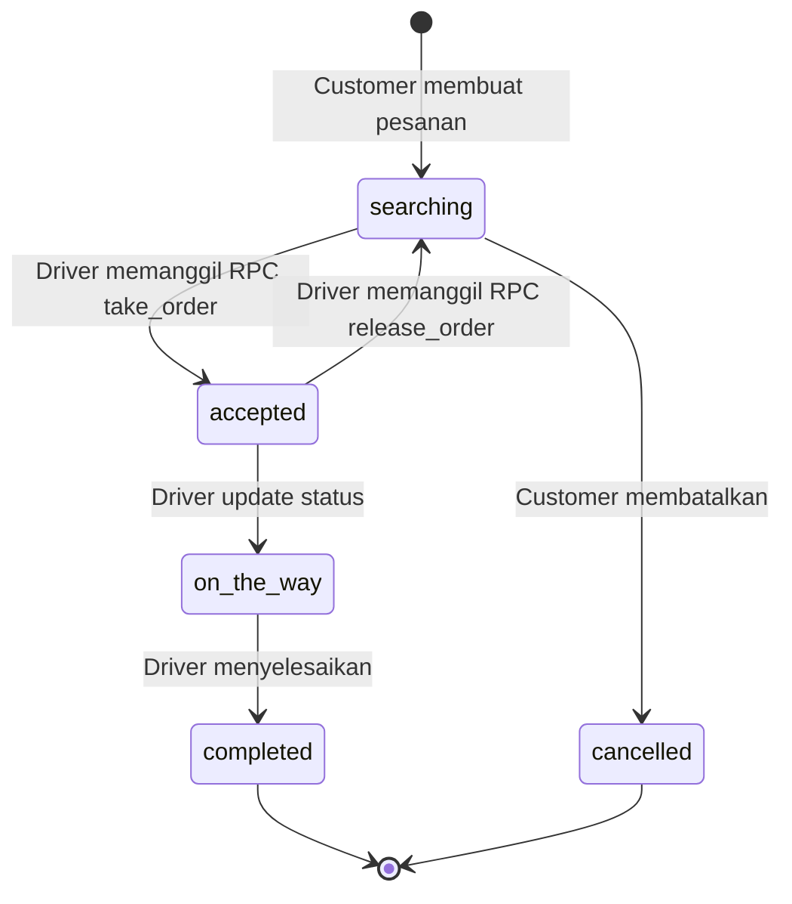

### Realtime Flow

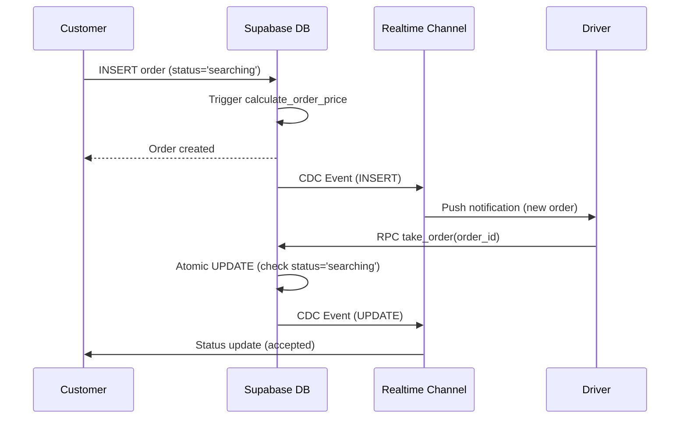

### Anti Race Condition

Fungsi `take_order` menggunakan pattern **optimistic locking** via SQL:

```sql
UPDATE orders
SET driver_id = auth.uid(), status = 'accepted'
WHERE id = order_uuid
  AND driver_id IS NULL        -- Belum diambil
  AND status = 'searching';    -- Masih tersedia
```

Jika 2 driver menekan tombol "Ambil" bersamaan, hanya 1 yang berhasil (ROW_COUNT = 1).

---

## 8. Integrasi Peta & Routing

### Alur Kalkulasi Rute

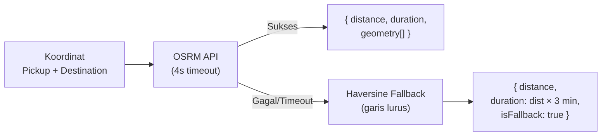

### Komponen Peta

| Komponen | Mode | Fitur |
|----------|------|-------|
| **MapPicker** | `single` | Pilih 1 lokasi (klik, GPS, search, drag) |
| **MapPicker** | `dual` | Pilih pickup + destination + auto-route |
| **OrderMap** | read-only | Tampilkan rute pesanan (green/red markers + polyline) |

### API Peta yang Digunakan

| Service | URL | Rate Limit | Fallback |
|---------|-----|-----------|----------|
| OSRM | `router.project-osrm.org` | Public demo, best-effort | Haversine formula |
| Nominatim | `nominatim.openstreetmap.org` | 1 req/sec | Koordinat numerik |
| OSM Tiles | `{s}.tile.openstreetmap.org` | Best-effort | - |

---

## 9. Model Keamanan

### Prinsip Keamanan

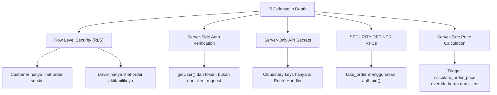

### Row Level Security (RLS) Policies

| Tabel | Policy | Deskripsi |
|-------|--------|-----------|
| `profiles` | SELECT | Semua user terautentikasi bisa baca (untuk JOIN) |
| `profiles` | UPDATE | Hanya pemilik profil (`auth.uid() = id`) |
| `orders` | SELECT (Customer) | Hanya lihat order sendiri (`auth.uid() = customer_id`) |
| `orders` | SELECT (Driver) | Lihat order `searching`/`cancelled` atau order miliknya |
| `orders` | INSERT | Hanya jika `auth.uid() = customer_id` |
| `orders` | UPDATE | Hanya customer atau driver yang terkait |

### Keamanan Upload Foto

1. ✅ Session diverifikasi server-side (`getUser()`)
2. ✅ MIME type divalidasi server-side
3. ✅ Avatar URL lama diambil dari DB (bukan dari request client)
4. ✅ Cloudinary API credentials tidak pernah dikirim ke client
5. ✅ Public ID Cloudinary diekstrak dari URL di server

### Keamanan Harga

Trigger `calculate_order_price` berjalan `BEFORE INSERT` dengan `SECURITY DEFINER`, artinya:
- Client boleh mengirim `total_price` apapun
- Server **selalu menimpa** dengan kalkulasi yang benar
- Mencegah manipulasi harga dari sisi client

---

## 10. Keputusan Desain

### ADR-001: Client-Side Query vs API Routes

**Keputusan:** Query Supabase langsung dari client components, bukan melalui API Routes.

**Alasan:**
- RLS sudah mengamankan akses data di level database
- Menghilangkan boilerplate API Route untuk setiap query
- Performa lebih baik (1 hop vs 2 hops)
- Supabase client mengelola token refresh otomatis

**Trade-off:** Tidak bisa menyembunyikan query logic dari client (mitigasi: RLS + trigger)

### ADR-002: SWR Manual vs Library (useSWR/React Query)

**Keputusan:** Implementasi SWR manual di `useProfile` hook.

**Alasan:**
- Mengurangi bundle size (tidak perlu library tambahan)
- Kontrol penuh atas cache invalidation
- Hanya 1 entity yang perlu di-cache (profile)
- Pattern sederhana: localStorage → state → background revalidate

### ADR-003: OSRM Public Server vs Self-Hosted

**Keputusan:** Menggunakan public demo server OSRM dengan Haversine fallback.

**Alasan:**
- Proyek kampus dengan skala kecil
- Tidak memerlukan SLA atau uptime guarantee
- Fallback otomatis jika OSRM tidak tersedia
- Budget nol untuk infrastruktur routing

### ADR-004: WhatsApp sebagai Channel Komunikasi

**Keputusan:** Tidak membangun chat in-app; menggunakan WhatsApp direct link.

**Alasan:**
- Mahasiswa sudah familiar dengan WhatsApp
- Tidak perlu membangun/maintain sistem chat
- Mendukung negosiasi harga untuk layanan Helper
- Pembayaran dilakukan tunai di luar sistem

### ADR-005: Dark Theme Only

**Keputusan:** Aplikasi hanya mendukung dark theme.

**Alasan:**
- Konsistensi desain tanpa kompleksitas theme switching
- Preferensi target audience (mahasiswa)
- Mengurangi maintenance CSS

---

## 11. Batasan & Ketergantungan Eksternal

| Ketergantungan | Jenis | Risiko | Mitigasi |
|----------------|-------|--------|----------|
| Supabase | BaaS (cloud) | Vendor lock-in, downtime | Standard PostgreSQL, bisa migrasi |
| Cloudinary | CDN | Rate limit (free tier) | Fallback ke avatar default |
| OSRM Demo Server | Public API | Unreliable, rate limited | Haversine fallback otomatis |
| Nominatim | Public API | 1 req/sec limit | Debounce 300ms, fallback ke koordinat |
| OSM Tiles | Public | Tile loading lambat | Cache browser bawaan |
| WhatsApp | External | Nomor harus valid | Format validasi `formatWhatsAppNumber` |

### Limitasi Arsitektur

1. **Tidak ada payment gateway** — Pembayaran tunai di luar sistem
2. **Tidak ada push notification** — Bergantung pada Realtime subscription (browser harus terbuka)
3. **Tidak ada tracking GPS real-time** — Hanya koordinat statis per pesanan
4. **Single-region deployment** — Belum mendukung multi-region
5. **Tidak ada rate limiting** — Bergantung pada Supabase dan API publik

---

## 12. Diagram Deployment

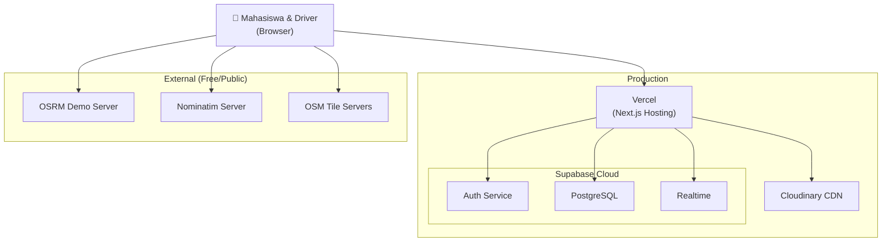

### Environment Variables (Production)

| Variable | Exposed to Client | Description |
|----------|:-:|-------------|
| `NEXT_PUBLIC_SUPABASE_URL` | ✅ | Supabase project URL |
| `NEXT_PUBLIC_SUPABASE_PUBLISHABLE_KEY` | ✅ | Supabase anon/publishable key |
| `CLOUDINARY_CLOUD_NAME` | ❌ | Cloudinary cloud name |
| `CLOUDINARY_API_KEY` | ❌ | Cloudinary API key |
| `CLOUDINARY_API_SECRET` | ❌ | Cloudinary API secret |

---

*Dokumen ini di-generate secara otomatis dan terakhir diperbarui pada Juni 2026.*
