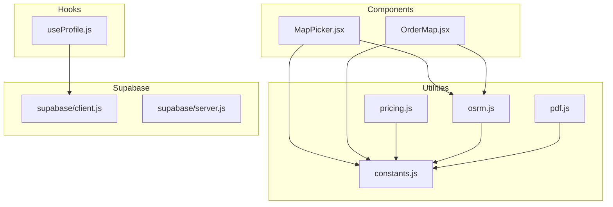
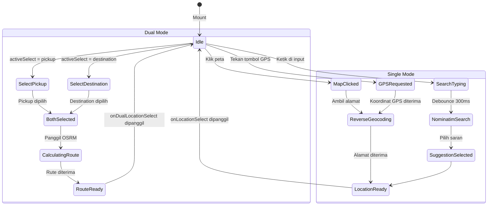
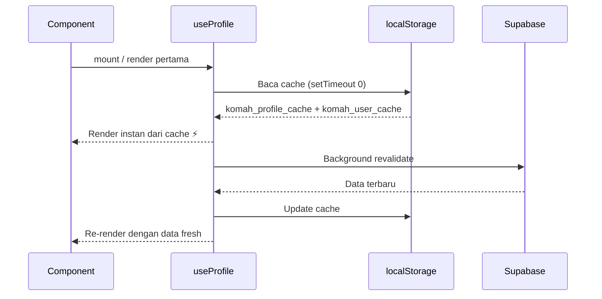
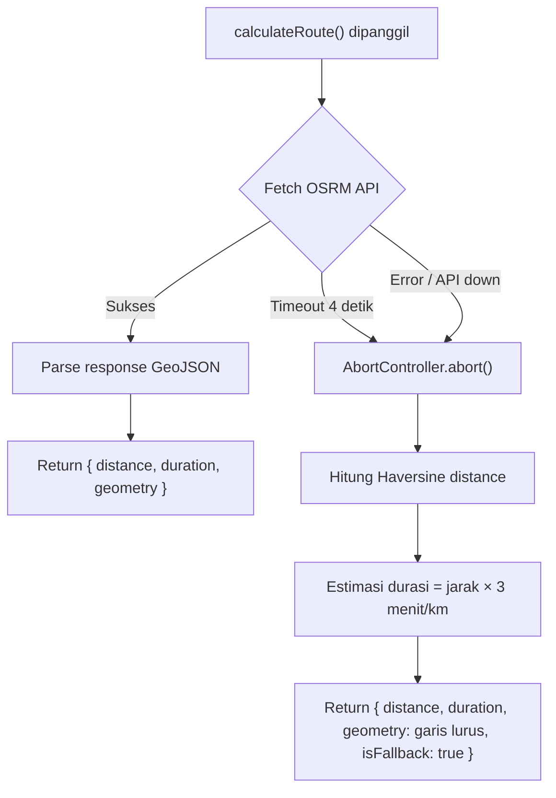
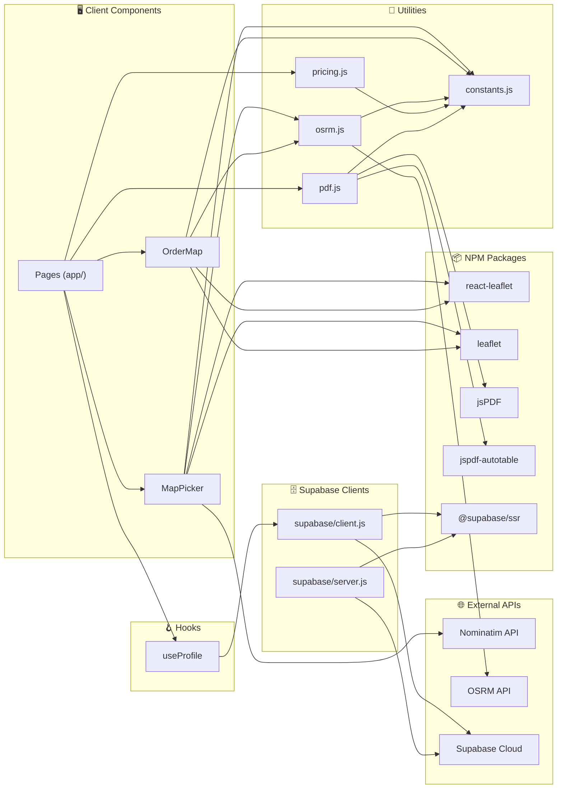

# 📚 Dokumentasi Komponen — KOMAH

> **KOMAH** — Ojek Kampus Hemat & Aman  
> Dokumentasi lengkap untuk seluruh React component, custom hook, dan utility module.

**Terakhir diperbarui:** 4 Juni 2026  
**Tech Stack:** Next.js · React · Leaflet · Supabase · jsPDF

---

## Daftar Isi

- [Arsitektur Komponen](#arsitektur-komponen)
- [Komponen](#komponen)
  - [MapPicker](#1-mappicker)
  - [OrderMap](#2-ordermap)
- [Custom Hooks](#custom-hooks)
  - [useProfile](#useprofile)
- [Utility Modules](#utility-modules)
  - [lib/constants.js](#libconstantsjs)
  - [lib/osrm.js](#libosrmjs)
  - [lib/pricing.js](#libpricingjs)
  - [lib/pdf.js](#libpdfjs)
  - [lib/supabase/client.js](#libsupabaseclientjs)
  - [lib/supabase/server.js](#libsupabaseserverjs)
- [Dependency Map](#dependency-map)

---

## Arsitektur Komponen

Diagram berikut menunjukkan relasi antar komponen, hook, dan utility module dalam project KOMAH:



---

## Komponen

### 1. MapPicker

| | |
|---|---|
| **File** | `components/MapPicker.jsx` |
| **Baris** | 698 baris |
| **Direktif** | `'use client'` |
| **Deskripsi** | Komponen peta interaktif untuk memilih lokasi. Mendukung mode tunggal (satu titik) dan mode ganda (pickup + tujuan dengan kalkulasi rute). |

#### Props

##### Mode Tunggal (`mode="single"`)

| Prop | Tipe | Default | Deskripsi |
|------|------|---------|-----------|
| `mode` | `'single' \| 'dual'` | `'single'` | Mode operasi komponen |
| `label` | `string` | — | Label teks di atas input alamat |
| `onLocationSelect` | `(location) => void` | — | Callback saat lokasi dipilih. Menerima `{ lat, lng, address }` |
| `markerType` | `'pickup' \| 'destination'` | `'pickup'` | Menentukan warna marker (hijau untuk pickup, merah untuk destination) |
| `placeholder` | `string` | `'Klik peta untuk memilih lokasi'` | Placeholder pada input pencarian |
| `initialPosition` | `[lat, lng]` | `null` | Posisi awal marker pada peta |

##### Mode Ganda (`mode="dual"`)

| Prop | Tipe | Default | Deskripsi |
|------|------|---------|-----------|
| `pickupLabel` | `string` | `'Titik Penjemputan'` | Label untuk input titik jemput |
| `destinationLabel` | `string` | `'Titik Tujuan'` | Label untuk input titik tujuan |
| `onDualLocationSelect` | `(data) => void` | — | Callback dengan data lengkap rute |
| `initialPickup` | `{ lat, lng, address }` | `null` | Posisi awal pickup |
| `initialDestination` | `{ lat, lng, address }` | `null` | Posisi awal tujuan |

**Struktur callback `onDualLocationSelect`:**

```js
{
  pickup:      { lat: number, lng: number, address: string },
  destination: { lat: number, lng: number, address: string },
  distance:    number,   // dalam km
  duration:    number,   // dalam menit
  geometry:    [number, number][]  // koordinat polyline rute
}
```

#### Fitur Utama

| Fitur | Deskripsi |
|-------|-----------|
| 🗺️ Klik peta | Klik di mana saja pada peta untuk memilih lokasi |
| 📍 GPS Geolocation | Tombol GPS untuk mengambil lokasi perangkat saat ini (`enableHighAccuracy`, timeout 10 detik) |
| 🔍 Pencarian alamat | Pencarian via Nominatim API dengan debounce 300ms, dibatasi wilayah Indonesia (Riau) |
| 🏷️ Reverse geocoding | Otomatis menerjemahkan koordinat menjadi alamat saat klik/drag marker |
| ✋ Draggable marker | Marker dapat ditarik untuk menyesuaikan posisi lokasi |
| 🛣️ Kalkulasi rute | Perhitungan rute otomatis via OSRM saat kedua titik tersedia (dual mode) |
| 📐 Auto-fit bounds | Peta otomatis zoom untuk menampilkan semua marker dengan padding 50px |
| 🔔 Toast feedback | Notifikasi pop-up untuk error (auto-hide setelah 3 detik) |

#### Komponen Internal

Komponen-komponen kecil yang hanya digunakan secara internal di dalam `MapPicker`:

| Komponen | Deskripsi |
|----------|-----------|
| `MapClickHandler` | Menangkap event klik pada peta menggunakan `useMapEvents` dari react-leaflet |
| `MapRefitter` | Melakukan auto-zoom dan fit bounds menggunakan `useMap` saat posisi pickup/destination berubah |

#### State Management



#### Contoh Penggunaan

**Single mode — pilih titik jemput:**

```jsx
import MapPicker from '@/components/MapPicker';

<MapPicker
  mode="single"
  label="Lokasi Jemput"
  markerType="pickup"
  placeholder="Cari lokasi..."
  onLocationSelect={(loc) => {
    console.log(loc.lat, loc.lng, loc.address);
  }}
/>
```

**Dual mode — pilih pickup & tujuan sekaligus:**

```jsx
<MapPicker
  mode="dual"
  pickupLabel="Dari Mana?"
  destinationLabel="Mau ke Mana?"
  onDualLocationSelect={(data) => {
    console.log(`Jarak: ${data.distance} km`);
    console.log(`Durasi: ${data.duration} menit`);
  }}
/>
```

**Dual mode — dengan initial position (edit order):**

```jsx
<MapPicker
  mode="dual"
  initialPickup={{ lat: 0.4634, lng: 101.3505, address: 'UIN SUSKA Riau' }}
  initialDestination={{ lat: 0.4700, lng: 101.3600, address: 'Mall SKA' }}
  onDualLocationSelect={handleRouteUpdate}
/>
```

#### External Dependencies

| Library | Kegunaan |
|---------|----------|
| `react-leaflet` | Rendering peta interaktif (MapContainer, TileLayer, Marker, Polyline) |
| `leaflet` | Engine peta dan ikon marker |
| `next/image` | Optimasi gambar ikon (GPS, loading, pin) |

#### External API

| API | Endpoint | Kegunaan |
|-----|----------|----------|
| Nominatim (Search) | `nominatim.openstreetmap.org/search` | Pencarian alamat berdasarkan teks (viewbox dibatasi wilayah Riau) |
| Nominatim (Reverse) | `nominatim.openstreetmap.org/reverse` | Menerjemahkan koordinat → alamat (bahasa Indonesia) |
| OSRM | via `lib/osrm.js` | Kalkulasi rute dan jarak (dual mode) |

---

### 2. OrderMap

| | |
|---|---|
| **File** | `components/OrderMap.jsx` |
| **Baris** | 139 baris |
| **Direktif** | `'use client'` |
| **Deskripsi** | Komponen peta read-only untuk menampilkan rute pesanan yang sudah dibuat. Tidak dapat diklik atau diedit pengguna. |

#### Props

| Prop | Tipe | Required | Deskripsi |
|------|------|----------|-----------|
| `pickup` | `{ lat: number, lng: number }` | ✅ Ya | Koordinat titik penjemputan |
| `destination` | `{ lat: number, lng: number }` | ❌ Tidak | Koordinat titik tujuan (opsional untuk order Helper) |

#### Fitur

| Fitur | Deskripsi |
|-------|-----------|
| 🟢 Marker hijau | Menandai titik penjemputan (pickup) |
| 🔴 Marker merah | Menandai titik tujuan (destination) |
| 🟡 Route polyline | Garis rute berwarna emas (`#F0C052`), weight 5, opacity 0.85 |
| ⏳ Loading overlay | Tampilan loading saat menghitung rute (backdrop blur) |
| 📐 Auto-fit bounds | Peta otomatis menyesuaikan zoom dengan padding 40px |
| ⚠️ Fallback UI | Menampilkan pesan "Lokasi tidak tersedia" jika `pickup` bernilai `null` |

#### Komponen Internal

| Komponen | Deskripsi |
|----------|-----------|
| `MapRefitter` | Auto-zoom untuk menampilkan pickup dan destination. Zoom ke level 16 jika hanya pickup tersedia. |

#### Contoh Penggunaan

```jsx
import OrderMap from '@/components/OrderMap';

// Tampilkan rute order lengkap
<div className="h-[300px]">
  <OrderMap
    pickup={{ lat: 0.4634, lng: 101.3505 }}
    destination={{ lat: 0.4700, lng: 101.3600 }}
  />
</div>

// Order tanpa destination (misal: Helper)
<OrderMap pickup={{ lat: 0.4634, lng: 101.3505 }} />

// Jika pickup null — tampilkan fallback
<OrderMap pickup={null} />
// → Render: "Lokasi tidak tersedia."
```

#### Perbedaan dengan MapPicker

| Aspek | MapPicker | OrderMap |
|-------|-----------|---------|
| Interaksi | Interaktif (klik, drag, search) | Read-only |
| Tujuan | Input lokasi baru | Menampilkan rute existing |
| Marker | Draggable | Statis |
| Pencarian | Nominatim search bar | Tidak ada |
| GPS | Tombol geolocation | Tidak ada |
| Kompleksitas | 698 baris | 139 baris |

---

## Custom Hooks

### useProfile

| | |
|---|---|
| **File** | `lib/hooks/useProfile.js` |
| **Baris** | 130 baris |
| **Direktif** | `'use client'` |
| **Deskripsi** | Hook untuk mengelola state profil dan autentikasi pengguna dengan pola Stale-While-Revalidate (SWR). |

#### Return Value

| Property | Tipe | Deskripsi |
|----------|------|-----------|
| `profile` | `object \| null` | Data profil dari tabel `profiles` di Supabase |
| `user` | `object \| null` | Data auth user dari `supabase.auth.getSession()` |
| `loading` | `boolean` | `true` selama proses fetching berlangsung |
| `error` | `string \| null` | Pesan error jika terjadi kegagalan |
| `refetch` | `() => void` | Fungsi untuk memaksa refetch data dari Supabase |

#### Strategi Cache (SWR Pattern)



| Key localStorage | Deskripsi |
|-----------------|-----------|
| `komah_profile_cache` | Data profil dari tabel `profiles` (JSON) |
| `komah_user_cache` | Data auth user dari Supabase session (JSON) |
| `driverProfilePic` | Cache foto profil driver (dibersihkan saat logout) |
| `userProfilePic` | Cache foto profil user (dibersihkan saat logout) |

> **Catatan:** `setTimeout(0)` digunakan saat membaca cache dari localStorage untuk menghindari hydration mismatch antara server dan client rendering.

#### Event Autentikasi

| Event | Aksi |
|-------|------|
| `SIGNED_IN` | Refetch profil secara silent (tanpa loading state) |
| `USER_UPDATED` | Refetch profil secara silent |
| `SIGNED_OUT` | Hapus semua state + seluruh cache localStorage |

#### Contoh Penggunaan

```jsx
'use client';
import { useProfile } from '@/lib/hooks/useProfile';

export default function Dashboard() {
  const { profile, user, loading, error, refetch } = useProfile();

  if (loading) return <p>Memuat profil...</p>;
  if (error) return <p>Error: {error}</p>;
  if (!user) return <p>Silakan login terlebih dahulu.</p>;

  return (
    <div>
      <h1>Halo, {profile?.full_name}!</h1>
      <p>Role: {profile?.role}</p>
      <button onClick={refetch}>Refresh Profil</button>
    </div>
  );
}
```

---

## Utility Modules

### `lib/constants.js`

| | |
|---|---|
| **Baris** | 96 baris |
| **Deskripsi** | Satu sumber kebenaran (*single source of truth*) untuk seluruh konfigurasi, tarif, dan helper function aplikasi KOMAH. |

#### Konstanta Utama

##### `PRICING` — Konfigurasi Tarif

| Key | Nilai | Deskripsi |
|-----|-------|-----------|
| `BASE_PRICE` | `5000` | Harga minimum semua layanan (Rp 5.000) |
| `PRICE_PER_KM` | `2000` | Tarif per kilometer (Rp 2.000/km) |
| `HELPER_MIN_PRICE` | `5000` | Harga minimum layanan Helper (negosiasi via WhatsApp) |

##### `MAP_CONFIG` — Konfigurasi Peta

| Key | Nilai | Deskripsi |
|-----|-------|-----------|
| `DEFAULT_CENTER` | `[0.4634, 101.3505]` | Koordinat default (Kampus UIN SUSKA Riau) |
| `DEFAULT_ZOOM` | `15` | Level zoom default |
| `MIN_ZOOM` | `10` | Zoom minimum yang diperbolehkan |
| `MAX_ZOOM` | `18` | Zoom maksimum yang diperbolehkan |
| `TILE_URL` | `https://{s}.tile.openstreetmap.org/...` | URL tile OpenStreetMap |
| `TILE_ATTRIBUTION` | `© OpenStreetMap` | Atribusi peta |

##### `OSRM_BASE_URL`

```
https://router.project-osrm.org
```

Public demo server OSRM untuk kalkulasi rute.

##### `ORDER_TYPES` — Jenis Layanan

| Key | Label | Ikon |
|-----|-------|------|
| `bike` | Antar/Jemput | `bike` |
| `delivery` | Delivery | `delivery` |
| `food` | KOMAH Food | `food` |
| `helper` | Helper | `helper` |

##### `ORDER_STATUS` — Status Pesanan

| Key | Label | Warna CSS |
|-----|-------|-----------|
| `searching` | Mencari Driver | `text-orange` |
| `accepted` | Driver Ditemukan | `text-purple` |
| `on_the_way` | Dalam Perjalanan | `text-on-secondary-container` |
| `completed` | Selesai | `text-success` |
| `cancelled` | Dibatalkan | `text-cancel` |

#### Helper Functions

##### `formatWhatsAppNumber(phone)`

Mengonversi nomor telepon Indonesia ke format internasional WhatsApp.

```js
formatWhatsAppNumber('08123456789')  // → '628123456789'
formatWhatsAppNumber('8123456789')   // → '628123456789'
formatWhatsAppNumber('628123456789') // → '628123456789'
```

##### `buildWhatsAppUrl(phoneNumber, orderNumber)`

Membuat URL WhatsApp `wa.me` dengan pesan template.

```js
buildWhatsAppUrl('08123456789', 'KMH-001')
// → 'https://wa.me/628123456789?text=Halo%2C%20saya%20terkait%20pesanan%20KOMAH%20...'
```

##### `formatRupiah(amount)`

Format angka ke format mata uang Rupiah Indonesia.

```js
formatRupiah(15000) // → 'Rp 15.000'
formatRupiah(0)     // → 'Rp 0'
```

##### `formatDate(dateString)`

Format tanggal ke format Indonesia lengkap.

```js
formatDate('2026-06-04T10:30:00Z')
// → '4 Juni 2026, 17.30'  (WIB)
```

---

### `lib/osrm.js`

| | |
|---|---|
| **Baris** | 71 baris |
| **Deskripsi** | Modul kalkulasi rute menggunakan OSRM API dengan fallback Haversine. |

#### `calculateRoute(pickupLat, pickupLng, destLat, destLng)`

Menghitung rute berkendara antara dua titik koordinat.

**Parameter:**

| Param | Tipe | Deskripsi |
|-------|------|-----------|
| `pickupLat` | `number` | Latitude titik penjemputan |
| `pickupLng` | `number` | Longitude titik penjemputan |
| `destLat` | `number` | Latitude titik tujuan |
| `destLng` | `number` | Longitude titik tujuan |

**Return:** `Promise<RouteResult>`

```ts
interface RouteResult {
  distance: number;           // Jarak dalam km (2 desimal)
  duration: number;           // Durasi dalam menit (pembulatan ke atas)
  geometry: [number, number][]; // Array koordinat [lat, lng] untuk polyline
  isFallback?: boolean;       // true jika menggunakan Haversine fallback
}
```

**Mekanisme Fallback:**



**Contoh:**

```js
import { calculateRoute } from '@/lib/osrm';

const route = await calculateRoute(0.4634, 101.3505, 0.4700, 101.3600);

console.log(route.distance);  // 2.45 (km)
console.log(route.duration);  // 8 (menit)
console.log(route.isFallback); // undefined (OSRM sukses) atau true (fallback)
```

---

### `lib/pricing.js`

| | |
|---|---|
| **Baris** | 25 baris |
| **Deskripsi** | Kalkulasi harga pesanan berdasarkan jarak dan tipe layanan. |

#### `calculatePrice(distanceKm, orderType)`

**Parameter:**

| Param | Tipe | Deskripsi |
|-------|------|-----------|
| `distanceKm` | `number` | Jarak tempuh dalam kilometer |
| `orderType` | `string` | Tipe order: `'bike'`, `'delivery'`, `'food'`, atau `'helper'` |

**Return:** `number` — Harga dalam Rupiah

**Formula:**

```
Jika orderType === 'helper':
  → HELPER_MIN_PRICE (Rp 5.000)

Jika orderType lainnya:
  → MAX(BASE_PRICE, CEIL(distanceKm) × PRICE_PER_KM)
  → MAX(5000, CEIL(jarak) × 2000)
```

**Tabel Contoh Harga:**

| Jarak (km) | Tipe | Hasil | Penjelasan |
|------------|------|-------|------------|
| `0.5` | `bike` | `Rp 5.000` | `CEIL(0.5)×2000 = 2000` → di bawah BASE, pakai BASE |
| `2.0` | `bike` | `Rp 5.000` | `CEIL(2)×2000 = 4000` → di bawah BASE, pakai BASE |
| `3.5` | `delivery` | `Rp 8.000` | `CEIL(3.5)×2000 = 8000` → di atas BASE |
| `10` | `food` | `Rp 20.000` | `CEIL(10)×2000 = 20000` |
| `*` | `helper` | `Rp 5.000` | Selalu HELPER_MIN_PRICE |

```js
import { calculatePrice } from '@/lib/pricing';

calculatePrice(3.5, 'bike')    // → 8000
calculatePrice(1.0, 'food')    // → 5000 (minimum BASE_PRICE)
calculatePrice(999, 'helper')  // → 5000 (selalu fixed)
```

---

### `lib/pdf.js`

| | |
|---|---|
| **Baris** | 182 baris |
| **Deskripsi** | Modul pembuatan dokumen PDF untuk struk pesanan dan laporan pendapatan driver. |
| **Dependencies** | `jspdf`, `jspdf-autotable` |

#### `generateOrderReceipt(order)`

Membuat dan men-download struk/bukti pesanan untuk pelanggan.

**Parameter:** `order` — Object data pesanan dari Supabase

**Struktur PDF yang dihasilkan:**

```
┌─────────────────────────────────────┐
│              KOMAH                  │
│     Ojek Kampus Hemat & Aman       │
│─────────────────────────────────────│
│  Bukti Pesanan                      │
│                                     │
│  No. Pesanan  : KMH-20260604-001   │
│  Tanggal      : 4 Juni 2026, 10.30 │
│  Waktu Jemput : 4 Juni 2026, 11.00 │
│  Tipe Layanan : Antar/Jemput        │
│  Status       : Selesai             │
│  Jarak        : 3.5 km             │
│                                     │
│  Detail Lokasi                      │
│  Penjemputan  : UIN SUSKA Riau      │
│  Tujuan       : Mall SKA Pekanbaru  │
│                                     │
│  Detail Layanan                     │
│  Jumlah Helm  : 2                   │
│                                     │
│  Catatan: Jemput di depan FTK       │
│─────────────────────────────────────│
│  Total Harga            Rp 8.000    │
│                                     │
│  Dokumen ini dibuat otomatis oleh   │
│  sistem KOMAH.                      │
└─────────────────────────────────────┘
```

**Nama file output:** `KOMAH_Struk_{order_number}.pdf`

#### `generateDriverReport(orders, period)`

Membuat dan men-download laporan pendapatan driver dengan tabel detail.

**Parameter:**

| Param | Tipe | Deskripsi |
|-------|------|-----------|
| `orders` | `object[]` | Array data order yang sudah completed |
| `period` | `string` | Label periode: `'Hari Ini'`, `'Minggu Ini'`, `'Bulan Ini'` |

**Struktur PDF yang dihasilkan:**

```
┌────────────────────────────────────────────┐
│                  KOMAH                     │
│        Laporan Pendapatan Driver           │
│────────────────────────────────────────────│
│  Periode: Minggu Ini                       │
│  Total Trip: 15                            │
│  Total Pendapatan: Rp 125.000              │
│                                            │
│  ┌───┬──────────┬──────────┬───────┬─────┐ │
│  │ # │ No.Order │ Tanggal  │Layan. │Harga│ │
│  ├───┼──────────┼──────────┼───────┼─────┤ │
│  │ 1 │ KMH-001  │ 1 Jun... │ Bike  │8.000│ │
│  │...│ ...      │ ...      │ ...   │ ... │ │
│  └───┴──────────┴──────────┴───────┴─────┘ │
│                                            │
│  Total Pendapatan:           Rp 125.000    │
│                                            │
│  Dicetak pada: 4 Juni 2026, 10.30          │
└────────────────────────────────────────────┘
```

**Nama file output:** `KOMAH_Laporan_{period}.pdf`

**Contoh:**

```js
import { generateOrderReceipt, generateDriverReport } from '@/lib/pdf';

// Download struk untuk pelanggan
generateOrderReceipt(orderData);

// Download laporan driver
generateDriverReport(completedOrders, 'Minggu Ini');
```

---

### `lib/supabase/client.js`

| | |
|---|---|
| **Baris** | 21 baris |
| **Direktif** | `'use client'` |
| **Deskripsi** | Singleton Supabase client untuk komponen client-side. |

#### `createClient()`

Membuat atau mengembalikan instance Supabase client yang sudah ada.

**Pola:** Singleton — hanya satu instance per tab browser.

**Environment Variables:**

| Variable | Deskripsi |
|----------|-----------|
| `NEXT_PUBLIC_SUPABASE_URL` | URL project Supabase |
| `NEXT_PUBLIC_SUPABASE_PUBLISHABLE_KEY` | Anon/publishable key Supabase |

```js
import { createClient } from '@/lib/supabase/client';

const supabase = createClient();
const { data } = await supabase.from('orders').select('*');
```

> ⚠️ **Penting:** Jangan gunakan client ini di Server Components atau Route Handlers. Gunakan `lib/supabase/server.js` sebagai gantinya.

---

### `lib/supabase/server.js`

| | |
|---|---|
| **Baris** | 33 baris |
| **Direktif** | — (server-only) |
| **Deskripsi** | Supabase client untuk Server Components, Route Handlers, dan Server Actions. |

#### `createClient()` (async)

Membuat instance Supabase client baru untuk setiap request. **Tidak boleh di-cache** karena harus membaca cookie segar dari setiap request.

**Pola:** Per-request — instance baru dibuat setiap pemanggilan.

**Environment Variables:**

| Variable | Fallback | Deskripsi |
|----------|----------|-----------|
| `NEXT_PUBLIC_SUPABASE_URL` | — | URL project Supabase |
| `NEXT_PUBLIC_SUPABASE_PUBLISHABLE_KEY` | `NEXT_PUBLIC_SUPABASE_ANON_KEY` | Publishable key dengan fallback ke anon key |

**Cookie Handling:**

- `getAll()` — Membaca semua cookie dari request
- `setAll()` — Menulis cookie (silent fail jika dipanggil dari Server Component, karena middleware menangani refresh session)

```js
import { createClient } from '@/lib/supabase/server';

// Di dalam Route Handler atau Server Action
export async function GET() {
  const supabase = await createClient();
  const { data } = await supabase.from('orders').select('*');
  return Response.json(data);
}
```

---

## Dependency Map

Diagram lengkap relasi seluruh module dan external service:



---

> 📝 **Catatan:** Dokumentasi ini dihasilkan berdasarkan kode sumber pada 4 Juni 2026. Jika ada perubahan pada komponen, mohon perbarui dokumen ini agar tetap sinkron.
