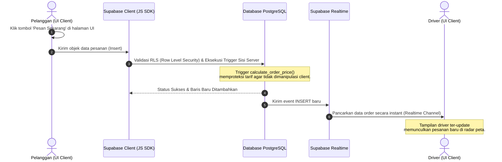

# 🗺️ Alur Kerja Sistem KOMAH (Panduan Developer Junior)

> Dokumen ini dirancang khusus untuk membantu developer junior memahami aliran data (*data flow*) di aplikasi KOMAH. Kami akan menelusuri alur data dari saat tombol di halaman web (UI) diklik oleh pengguna, melewati API client, hingga masuk ke database PostgreSQL Supabase dengan proteksi trigger dan keamanan RLS, lalu kembali dipancarkan secara realtime ke driver.

---

## Daftar Isi
1. [Gambaran Umum Arsitektur Aliran Data](#1-gambaran-umum-arsitektur-aliran-data)
2. [Alur 1: Pelanggan Membuat Pesanan (Ride/Delivery/Food)](#alur-1-pelanggan-membuat-pesanan-ridedeliveryfood)
3. [Alur 2: Driver Mengklaim Pesanan (RPC - Anti Race Condition)](#alur-2-driver-mengklaim-pesanan-rpc---anti-race-condition)
4. [Ringkasan Kode Penting dan Lokasinya](#4-ringkasan-kode-penting-dan-lokasinya)

---

## 1. Gambaran Umum Arsitektur Aliran Data

Aplikasi KOMAH adalah aplikasi Next.js berbasis *client-side rendering* (`'use client'`) yang berkomunikasi langsung dengan **Supabase** sebagai *backend-as-a-service* (BaaS).

Berikut adalah peta jalan perjalanan data di KOMAH:



---

## Alur 1: Pelanggan Membuat Pesanan (Ride/Delivery/Food)

Mari kita bedah secara mendalam langkah demi langkah saat seorang pelanggan menekan tombol **"Pesan Sekarang"** pada layanan Ride di file [page.jsx](../app/%28dashboard%29/user/ride/page.jsx).

### Langkah 1: Interaksi UI (Halaman Client)
Di halaman dasbor pelanggan, pengguna memilih lokasi penjemputan (*pickup*) dan tujuan (*destination*) menggunakan komponen `MapPicker`. Setelah semua form terisi (Waktu jemput, Catatan, Nomor WA), pengguna mengklik tombol **"Pesan Sekarang"**.
* **Berkas Sumber**: `app/(dashboard)/user/ride/page.jsx`
* **Elemen UI**:
  ```jsx
  <button onClick={handleOrder} disabled={isLoading || !pickup || !destination}>
    Pesan Sekarang
  </button>
  ```

### Langkah 2: Pemicu Fungsi JavaScript (Client-side)
Klik tombol memicu fungsi `handleOrder(e)`. Fungsi ini memvalidasi kelengkapan data di sisi browser dan memformat objek data pesanan.
* **Berkas Sumber**: `app/(dashboard)/user/ride/page.jsx` pada fungsi `handleOrder`:
  ```javascript
  const handleOrder = async (e) => {
    e.preventDefault();
    setIsLoading(true);
    
    // Inisialisasi Supabase Client
    const supabase = createClient();
    
    // Objek data yang dikirim ke database
    const orderData = {
      customer_id: user.id,
      type: 'bike',
      status: 'searching',
      pickup_location: pickup.address,
      pickup_lat: pickup.lat,
      pickup_lng: pickup.lng,
      destination_location: destination.address,
      destination_lat: destination.lat,
      destination_lng: destination.lng,
      distance_estimate: distance,
      total_price: price, // Nilai estimasi client (akan dihitung ulang di server demi keamanan)
      pickup_time: new Date(pickupTime).toISOString(),
      notes: notes,
      service_details: { whatsappNumber }
    };
    
    // Mengirim data ke Supabase (Tabel orders)
    const { error } = await supabase.from('orders').insert([orderData]);
    ...
  }
  ```

### Langkah 3: Pengiriman Data lewat Supabase JS SDK
Supabase Client (`lib/supabase/client.js`) mengirimkan perintah HTTP POST berupa format JSON ke endpoint REST API Supabase yang mengarah ke tabel `orders`.

### Langkah 4: Pemeriksaan Keamanan RLS di Sisi Database (Server-side)
Sebelum baris data baru ditambahkan ke tabel `orders` di PostgreSQL, database memeriksa kebijakan **Row Level Security (RLS)** yang diatur untuk tabel tersebut.
* **Berkas SQL**: `desain/DATABASE_SCHEMA.md`
* **Kebijakan yang Berpengaruh**:
  ```sql
  CREATE POLICY "Customers create orders" ON orders 
  FOR INSERT WITH CHECK (auth.uid() = customer_id);
  ```
* **Artinya**: Database akan memblokir (*reject*) proses insert jika ID pelanggan (`customer_id`) yang dikirim dari browser tidak sama dengan ID akun yang sedang login (`auth.uid()`). Ini mencegah peretasan di mana orang lain memesan atas nama akun Anda.

### Langkah 5: Eksekusi Trigger Proteksi Harga (Server-side)
Setelah lolos RLS dan sebelum data benar-benar disimpan (*BEFORE INSERT*), PostgreSQL menjalankan trigger proteksi harga `trg_calculate_order_price` yang memanggil fungsi `calculate_order_price()`.
* **Tujuan**: Mencegah kecurangan pelanggan yang memodifikasi nilai `total_price` di browser menggunakan inspect element/developer tools sebelum mengirim request.
* **Berkas SQL**: `desain/DATABASE_SCHEMA.md` pada fungsi `calculate_order_price()`:
  ```sql
  IF NEW.type = 'helper' THEN
    NEW.total_price := 5000.00; -- Set harga minimum helper
  ELSE
    -- Hitung ulang harga murni berdasarkan estimasi jarak sisi server:
    -- Jarak (dibulatkan ke atas) x Rp 2.000 per KM. Minimal Rp 5.000
    calculated_price := CEIL(NEW.distance_estimate) * 2000.00;
    NEW.total_price := GREATEST(5000.00, calculated_price);
  END IF;
  ```
* **Hasil**: Nilai `total_price` yang dikirim dari browser akan ditimpa (*override*) secara otomatis di server database dengan hasil kalkulasi matematis yang valid.

### Langkah 6: Penyimpanan & Realtime Broadcast
1. Baris data disimpan di tabel `orders`. Kolom `order_number` diisi otomatis dengan format sequential (`ORD-000001`, `ORD-000002`, dst).
2. Sesuai konfigurasi publikasi realtime (`ALTER PUBLICATION supabase_realtime ADD TABLE orders;`), PostgreSQL memancarkan event `INSERT` baru tersebut ke server websocket Supabase Realtime.

### Langkah 7: Penerimaan Realtime di Dasbor Driver
Dasbor Driver (`app/(dashboard)/driver/page.jsx`) menggunakan Supabase client untuk mendengarkan (*subscribe*) tabel `orders` secara realtime.
* **Berkas Sumber**: `app/(dashboard)/driver/page.jsx`
* **Kode Listener**:
  ```javascript
  const channel = supabase
    .channel('orders-realtime')
    .on('postgres_changes', { 
        event: 'INSERT', 
        schema: 'public', 
        table: 'orders',
        filter: "status=eq.searching" // Hanya dengar pesanan yang sedang mencari driver
      }, 
      (payload) => {
        // Otomatis tambahkan pesanan baru ke state aplikasi React
        setOrders((prev) => [payload.new, ...prev]);
      }
    )
    .subscribe();
  ```
* **Hasil**: Pesanan baru langsung muncul secara instan di layar driver tanpa perlu me-refresh halaman!

---

## Alur 2: Driver Mengklaim Pesanan (RPC - Anti Race Condition)

Ketika banyak driver melihat satu pesanan yang sama di layar mereka, ada risiko terjadi **race condition** (dua driver menekan tombol "Ambil" secara bersamaan dan keduanya mengira mereka mendapatkan pesanan tersebut). KOMAH mengatasi ini menggunakan fungsi RPC.

### Langkah 1: Driver Mengklik Tombol Ambil
Driver mengklik tombol "Ambil Pesanan" di file [pesanan/page.jsx](../app/%28dashboard%29/driver/pesanan/page.jsx).
* **Elemen UI**:
  ```jsx
  <button onClick={() => executeTakeOrder(order.id)}>
    Ambil Pesanan
  </button>
  ```

### Langkah 2: Panggilan Supabase RPC (Client-side)
Fungsi `executeTakeOrder` memanggil fungsi database `take_order` lewat perantara Supabase RPC:
* **Berkas Sumber**: `app/(dashboard)/driver/pesanan/page.jsx`
  ```javascript
  const { data: success, error } = await supabase.rpc('take_order', { 
    order_uuid: orderId 
  });
  ```

### Langkah 3: Eksekusi Operasi Atomik PostgreSQL (Server-side)
PostgreSQL menjalankan fungsi database `take_order` yang telah dibuat.
* **Berkas SQL**: `desain/DATABASE_SCHEMA.md`
* **Kode Fungsi SQL**:
  ```sql
  CREATE OR REPLACE FUNCTION public.take_order(order_uuid UUID)
  RETURNS BOOLEAN AS $$
  DECLARE
    affected_rows INTEGER;
  BEGIN
    UPDATE public.orders
    SET driver_id = auth.uid(), status = 'accepted'
    WHERE id = order_uuid AND driver_id IS NULL AND status = 'searching';

    GET DIAGNOSTICS affected_rows = ROW_COUNT;
    RETURN affected_rows > 0;
  END;
  $$ LANGUAGE plpgsql SECURITY DEFINER;
  ```
* **Mengapa ini aman dari balapan (Race Condition)?**
  * Klausa `WHERE driver_id IS NULL AND status = 'searching'` memastikan data hanya dapat diperbarui jika pesanan tersebut **belum diambil siapapun**.
  * PostgreSQL memiliki fitur *Row Locking*. Transaksi yang pertama kali masuk akan mengunci baris tersebut, mengubah `driver_id` dan `status`.
  * Driver kedua yang menekan tombol sepersekian detik setelahnya akan mendapati klausa `WHERE` tidak terpenuhi (karena `driver_id` sudah tidak `NULL` lagi). Update mengembalikan `affected_rows = 0` (mengembalikan nilai `false` ke client).

### Langkah 4: Respon Balik ke Driver
* Driver pertama menerima respon `success = true`, aplikasi mengarahkannya ke halaman peta navigasi penjemputan.
* Driver kedua menerima respon `success = false`, aplikasi memunculkan notifikasi kesalahan *"Maaf, pesanan sudah diambil oleh pengemudi lain!"*.

---

## 4. Ringkasan Kode Penting dan Lokasinya

| Fungsi / Komponen | Peran Utama | Berkas Kode | Bahasa Pemrograman |
|---|---|---|---|
| **Form Pemesanan UI** | Menangkap input peta & data pemesan | [ride/page.jsx](../app/%28dashboard%29/user/ride/page.jsx) | JavaScript (Next.js/React) |
| **Supabase Client** | Menjembatani request API dari browser | [client.js](../lib/supabase/client.js) | JavaScript |
| **Keamanan RLS** | Membatasi hak akses insert & select | [DATABASE_SCHEMA.md](../desain/DATABASE_SCHEMA.md) | PostgreSQL SQL |
| **Trigger Tarif** | Menghitung dan mengunci tarif di server | [DATABASE_SCHEMA.md](../desain/DATABASE_SCHEMA.md) | PostgreSQL PL/pgSQL |
| **RPC `take_order`** | Transaksi aman untuk klaim ojek | [DATABASE_SCHEMA.md](../desain/DATABASE_SCHEMA.md) | PostgreSQL PL/pgSQL |
| **Realtime Channel** | Mengirim pesanan langsung tanpa refresh | [driver/page.jsx](../app/%28dashboard%29/driver/page.jsx) | JavaScript (Supabase SDK) |
