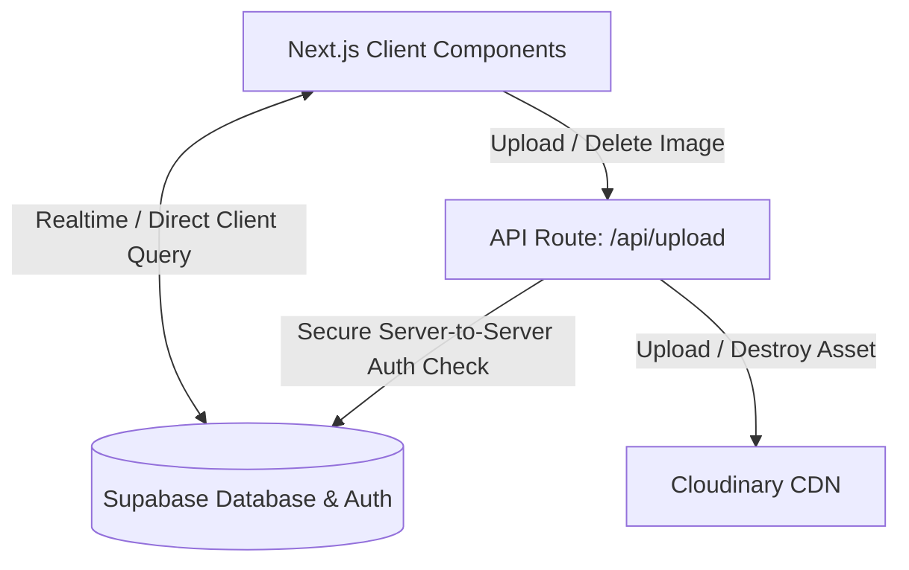
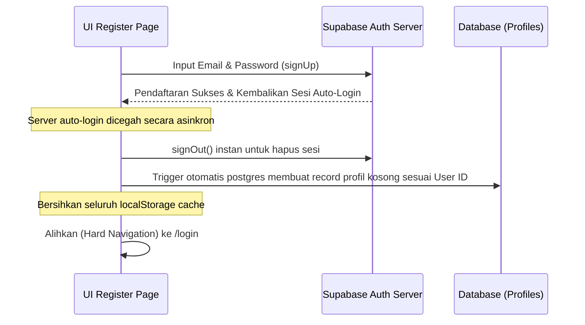
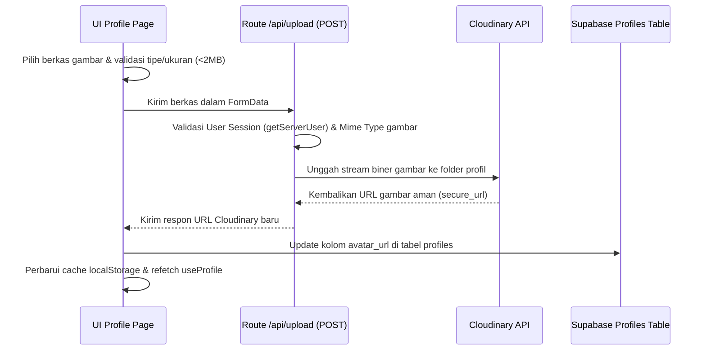
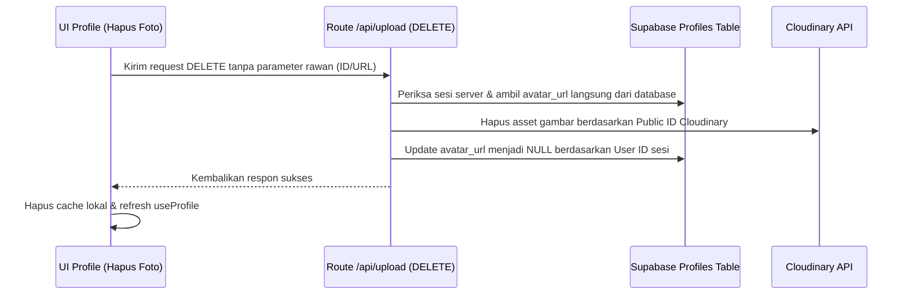
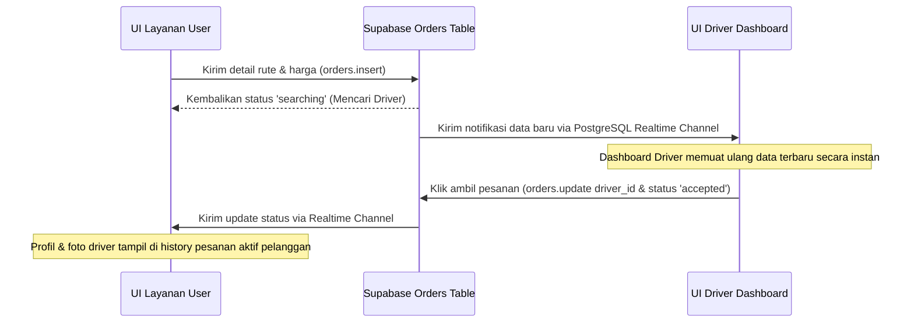

# Dokumentasi Arsitektur & Alur Kerja Aplikasi KOMAH

Dokumen ini menjelaskan arsitektur sistem, cara kerja program secara client-side query (Supabase Client), manajemen cache profil, dan bagaimana suatu aksi di antarmuka pengguna (UI) mengalir hingga disimpan ke dalam basis data (database).

---

## 1. Ikhtisar Arsitektur (Architecture Overview)

KOMAH menggunakan arsitektur **Next.js (App Router)** dengan pola **Client-Side Query & State Management** terpusat menggunakan layanan backend-as-a-service **Supabase** dan penyimpanan gambar **Cloudinary**:

### Komponen Utama:
1.  **Frontend (Next.js)**: Berjalan secara *client-side* murni (`'use client'`) untuk interaksi responsif (0ms delay) menggunakan SWR (Stale-While-Revalidate) caching buatan sendiri.
2.  **Supabase Auth & Database**: Menangani sesi otentikasi pengguna, penyimpanan data relasional (tabel `profiles`, `orders`), serta sinkronisasi data instan via *PostgreSQL Realtime Channel*.
3.  **Route Handlers (Next.js API)**: Endpoint `/api/upload` digunakan khusus sebagai *secure bridge* untuk mengunggah dan menghapus aset gambar di Cloudinary secara aman agar kunci API rahasia Cloudinary tidak bocor ke sisi client.

---

## 2. Cara Kerja Hook `useProfile` & Sinkronisasi Cache

Untuk performa instan tanpa membebani database, profil pengguna dikelola oleh hook [useProfile.js](file:///lib/hooks/useProfile.js):

1.  **Inisialisasi Aman (Bebas Hydration Mismatch)**:
    Untuk menghindari kesalahan perbedaan render HTML server vs client, state `profile` diinisialisasi `null` dan `loading` diinisialisasi `true`.
2.  **Pemuatan Asinkron (`useEffect`)**:
    Setelah komponen berhasil dimuat di client (mount), `useEffect` membaca cache dari `localStorage` (`komah_profile_cache`) di dalam `setTimeout(..., 0)` dan memperbarui state secara asinkron.
3.  **Sinkronisasi Latar Belakang (SWR)**:
    Jika cache tersedia, antarmuka langsung dirender menggunakan data cache. Secara bersamaan, request background dikirim ke Supabase untuk mencocokkan data terbaru di database. Jika ada perbedaan, UI diperbarui secara halus tanpa interupsi.
4.  **Pembersihan Otomatis**:
    Saat pengguna keluar (logout) atau saat masuk ke halaman pendaftaran (registrasi), semua cache di `localStorage` (termasuk `'driverProfilePic'` dan `'userProfilePic'`) dihapus secara total untuk mencegah kebocoran data antar-sesi pengguna.

---

## 3. Alur Kerja Aksi UI ke Database (UI Action to Database Flow)

Berikut adalah 4 contoh skenario bagaimana interaksi pengguna mengalir dari komponen UI hingga tersimpan secara permanen di database:

### A. Alur Registrasi Akun Baru

1.  **UI Action**: Pengguna mengisi form di `/register/pengguna` atau `/register/driver` dan menekan **"Daftar"**.
2.  **API Request**: Memanggil client-side helper `supabase.auth.signUp()`.
3.  **Database Layer**: Supabase Auth mencatat user baru dan memicu fungsi pemicu database (*database trigger*) secara internal untuk membuat baris profil kosong baru di tabel `profiles` dengan ID yang sesuai.
4.  **Bypass Auto-Redirect**: Karena Supabase lokal mengizinkan auto-login, client langsung memanggil `supabase.auth.signOut()` untuk membersihkan cookies, menghapus cache lokal, dan memaksa navigasi bersih ke `/login`.

---

### B. Alur Mengunggah / Mengganti Foto Profil

1.  **UI Action**: Pengguna memilih file gambar lewat input file dan menekan ikon pensil.
2.  **Mime & Size Check**: Aplikasi memvalidasi file di client (harus tipe `image/*` dan ukuran `< 2MB`).
3.  **API upload**: Mengirim request POST berisi berkas gambar ke `/api/upload`.
4.  **Security & CDN Upload**: Endpoint memeriksa sesi user di server, mengunggah biner gambar ke folder Cloudinary yang sesuai (`driver_profiles` atau `customer_profiles`), lalu mengembalikan URL gambar yang aman.
5.  **Database Write**: Client menerima URL tersebut, memanggil `supabase.from('profiles').update({ avatar_url: secureUrl })` untuk disimpan di database, memperbarui cache lokal, dan memicu event sinkronisasi agar foto profil di Navbar berubah secara real-time.

---

### C. Alur Menghapus Foto Profil (DELETE)

1.  **UI Action**: Pengguna menekan tombol hapus (ikon silang merah) pada mode edit foto profil.
2.  **API DELETE Request**: Menembak request DELETE ke `/api/upload`. Tidak ada parameter ID/URL yang dikirim dari client untuk mencegah manipulasi data orang lain.
3.  **Server Authentication & Select**: Server membaca sesi user aktif, lalu mengambil data `avatar_url` langsung dari tabel database `profiles` berdasarkan User ID sesi.
4.  **CDN Destroy**: Server mengurai URL gambar, mengekstrak Public ID-nya, lalu memanggil `cloudinary.uploader.destroy(publicId)` untuk menghapus berkas fisik di Cloudinary.
5.  **Database Nullify**: Server melakukan update kolom `avatar_url` menjadi `null` di database dan mengembalikan respon sukses. Client menghapus cache lokalnya dan memicu pembaruan UI.

---

### D. Alur Pemesanan Hingga Deteksi Realtime oleh Driver

1.  **UI Action**: Pelanggan memilih lokasi jemput & tujuan di halaman order (misal `/user/ride`), lalu menekan **"Pesan Sekarang"**.
2.  **Database Insert**: Client memproses perhitungan harga dan memanggil `supabase.from('orders').insert(...)` untuk menambahkan baris pesanan baru dengan status `searching`.
3.  **Realtime Event Propagation**: Supabase secara instan menyiarkan event penambahan baris data baru melalui *PostgreSQL Realtime Channel* ke seluruh driver yang berlangganan (*subscribed*).
4.  **UI Update (Driver)**: Halaman `/driver` menerima payload realtime tersebut secara instan, memicu pembaruan data, dan menampilkan pesanan baru di peta driver secara instan tanpa perlu reload halaman.
5.  **Order Acceptance**: Driver menekan **"Ambil Pesanan"**, memperbarui kolom `driver_id` dan `status` ke `accepted`. Pelanggan menerima pembaruan ini secara realtime dan menampilkan info lengkap driver (nama, plat kendaraan, dan foto profil driver) di kartunya.
